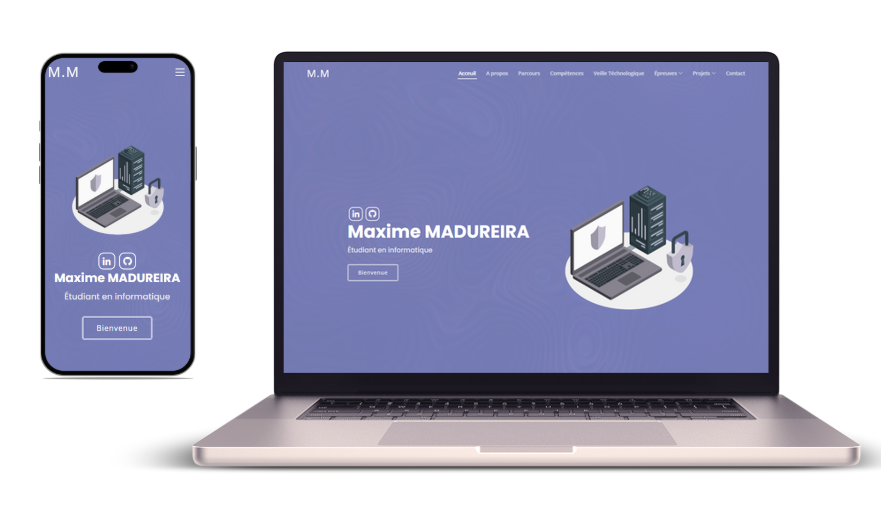

# Portfolio BTS SIO - Maxime MADUREIRA
https://nivomax.github.io/Portfolio-BTS/

## A propos du projet
Ce portfolio est développé dans le cadre de mon épreuve de BTS SIO . Il vise à présenter mes compétences techniques ainsi que les projets sur lesquels j'ai travaillé au cours de ma formation. Ce site est une vitrine de mon savoir-faire en informatique.

## Technologies utilisées
- HTML
- CSS
- JavaScript
- PHP
- Bootstrap

## Fonctionnalités principales
- Présentation personnelle et parcours scolaire et professionnel
- Galerie de projets développés au cours du BTS
- Détails sur les compétences techniques acquises

## Contact
Pour toute question ou demande, vous pouvez me contacter via:

Email : madureirapro@gmail.com
LinkedIn : www.linkedin.com/in/maxime-madureira

